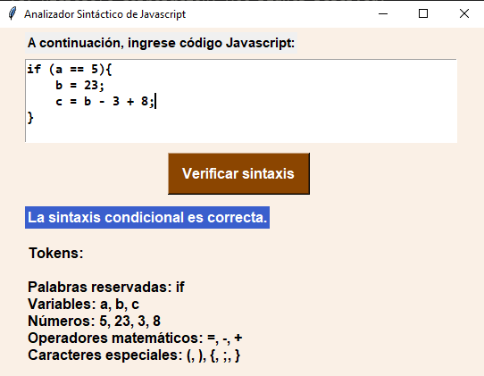

# JS Syntax Parser
This script analyze if a given JS statement is correct.

# Only recognize the following JS reserved words and their respective syntax:
- var
- let
- if
- else
- for
- break
- continue

# Screenshot
